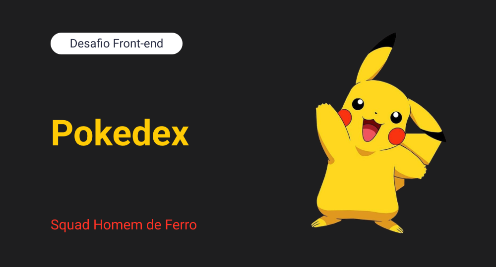

# Desafio Front-end - Pokedex - Squad Homem de Ferro
Projeto base para o desafio do dia 11/11/2022. Você deve fazer um clone do projeto porém deverá criar um projeto no seu github ou gitlab para que o projeto seja seu.

## Primeiros Passos
--------------
Para clonar o projeto você deve fazer
```
$ git clone https://github.com/airlonfilho/pokedexstart.git
$ cd pokedexstart
```

Após clonar e entrar na pasta do projeto, deve instalar as dependências usando o npm
```
$ npm install
```
--------------
## License

MIT


